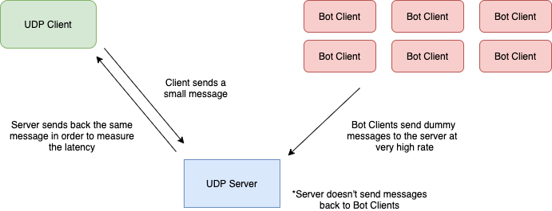

# UDP DoS

Denial of Service implementation using User Datagram Protocol. Developed and tested on CATLab machines.

## High-level architecture

<!--- HTML markdown to center the image --->

    

## Parts

- **UDP Server**: Simple UDP server listenning to all IPs on port 9000. Source: [server.py](src/server.py)
- **UDP Client**: Simple UDP client communicating with the UDP Server via short messages. Source: [client.py](src/client.py)
- **Bot Client**: Bot UDP Client sends messages of 1024 bytes long to the UDP Server at very high rates. Source: [bot_client.py](src/bot_client.py)

