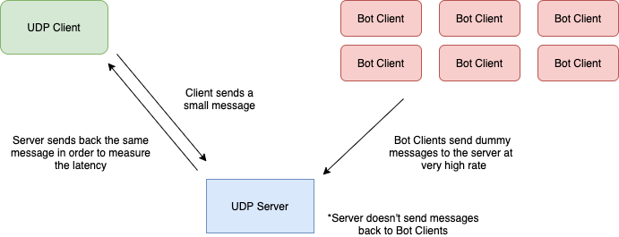

# UDP DoS

Denial of Service implementation using User Datagram Protocol. Developed and tested on CATLab machines.

**Class:** CS 4280: Distributed Systems 

**Developers:** Quang and Zak

## High-level architecture

<!--- HTML markdown to center the image --->

    

## Parts

- **UDP Server**: Simple UDP server listenning to all IPs on port 9000. Source: [server.py](src/server.py)
- **UDP Client**: Simple UDP client communicating with the UDP Server via short messages. Source: [client.py](src/client.py)
- **Bot Client**: Bot UDP Client sends messages of 1024 bytes long to the UDP Server at very high rates. Source: [bot_client.py](src/bot_client.py)
- **CPU Tracker**: Extra tool to track CPU usage of local machines. Used on the UDP Server during development. Source: [get_cpu.py](src/get_cpu.py)

## Using

### Getting ready

0. Make sure you have SSH access to the CATLab and can find available IPs.
1. Choose one CATLab machine to be a UDP Server. Remember its IP
2. Choose another one to be a UDP Client. Remember its IP
3. Choose at least two CATLab machines to be bots.

### DoS in action

1. Run [install.sh](src/install.sh) script on UDP server. This would install all the needed components and run the server on the machine.
As of the latest commit, the server would instead listen to all clients, including bots. This would help to showcase better what exactly were the steps taken in an attempt to stop the attacks.

2. Run [client.py](src/client.py) on UDP Client: `python3 client.py <ip_addr_of_udp_server>`. Pass UDP Server's IP to point the client to it.

3. Server and Client should be exchanging messages at this point. Client shows how fast the exchange is going every five seconds. Server will print every message received from client.

4. (Optional) At this point you could also run [get_cpu.py](src/get_cpu.py) on the UDP Server in order to see how CPU usage changes right after bots are activated.

5. Run [bot_client.py](src/bot_client.py) on the **first** bot machine: `python3 bot_client.py <ip_addr_of_udp_server>`. Pass UDP Server's IP to point the bot to it.

6. Repeat `step#5` to add another bot.

7. Our sample runs show that two bots are enough to DoS the server and timeout regular client's session. If the client is still communicating with the server, continue adding more bots, and eventually, you will crash the server.

### Defense Against DoS in Action

(4/2/2020) The server now has a rate limiter built in that by utilizing the system's firewalls (iptables on Linux and only Linux for now) would block whichever IP is sending too many requests in a short amount of time.

(4/6/2020) (Q-Hx) Despite the fact that the server is working as expected, it is still a failure overall on the defense side. The IPs are indeed blocked, as the server would stop receiving package from any clients that violate the rate limiter.

However, due to the fact that the protocol is UDP, my assumption is that the server would still have already received the packet before dropping it. The result is that the bots would still be able to throttle the bandwidth (or block the port? whichever it is) and block the client from being able to make a connection.

Some solutions that we have discussed include installing a proxy server or implement a load balancer. Both of these seem to be overkill for the amount of time we have and the amount of skill we possess. For a future note, the most common advice I have seen on the Internet on how to prevent an UDP flood attack would be to prevent it at the very edge (upstream, however you call it) of the network.

I am definitely interested in being able to improve upon this, though again,we might do something similar to that in the future anyways, so what I'd say is that this served as a great learning experience.
